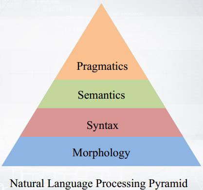

# NLP Pyramid

The image below is a Natural Language Processing (NLP) Pyramid, a conceptual diagram showing the layered structure of how language is understood and processed by machines. Each layer builds upon the one below it — from raw forms to higher meaning.

### 🧱 1. **Morphology** – Word Pieces

💬 *What are the parts of a word?*

* Example: **“unhappiness”** = un + happy + ness
* Think: cutting words into useful pieces.

### 🧱 2. **Syntax** – Sentence Structure

💬 *How are words arranged?*

* Example: **“The dog runs.”** is correct, but **“Dog the runs”** is weird.
* Think: grammar rules.

### 🧱 3. **Semantics** – Word Meaning

💬 *What do the words mean?*

* Example: **“Bank”** – is it for money or a river?
* Think: understanding the *real meaning* of words.

### 🧱 4. **Pragmatics** – Real-Life Meaning

💬 *What do you actually mean?*

* Example: You say, **“Can you pass the salt?”** — you're not asking about ability, you're politely asking for salt.
* Think: tone, context, intention.

### 🚀 So how does NLP work?

It starts with breaking down words (morphology),
figures out sentence structure (syntax),
understands meaning (semantics),
and finally gets your *real* point (pragmatics).

