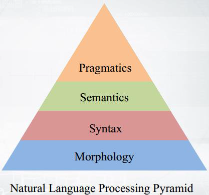

wh# NLP Pyramid

The image below is a Natural Language Processing (NLP) Pyramid, a conceptual diagram showing the layered structure of how language is understood and processed by machines. Each layer builds upon the one below it — from raw forms to higher meaning.

### 🧱 1. **Morphology** – Word Pieces

💬 *What are the parts of a word?*

* Example: **“unhappiness”** = un + happy + ness
* Think: cutting words into useful pieces.

### 🧱 2. **Syntax** – Sentence Structure

💬 *How are words arranged?*

* Example: **“The dog runs.”** is correct, but **“Dog the runs”** is weird.
* Think: grammar rules.

### 🧱 3. **Semantics** – Word Meaning

💬 *What do the words mean?*

* Example: **“Bank”** – is it for money or a river?
* Think: understanding the *real meaning* of words.

### 🧱 4. **Pragmatics** – Real-Life Meaning

💬 *What do you actually mean?*

* Example: You say, **“Can you pass the salt?”** — you're not asking about ability, you're politely asking for salt.
* Think: tone, context, intention.

### 🚀 So how does NLP work?

It starts with breaking down words (morphology),
figures out sentence structure (syntax),
understands meaning (semantics),
and finally gets your *real* point (pragmatics).

# ❓ Why is NLP hard?

1. **Different grammar rules** are used by different people — even in the same language.
2. **High grammar flexibility** — natural languages are messy, full of exceptions and odd structures.
3. **People skip punctuation**, making it harder for machines to understand sentences.
4. **Same sentence can mean different things** depending on how you read it.

---

### 🧠 Example:

> **"At last a computer that understands you like your mother"**

This sentence is **grammatically correct**, but its **meaning is unclear**. It could mean:

1. The computer understands you **as well as your mother understands you**.
2. The computer understands that **you like your mother**.
3. The computer understands you **just as it understands your mother**.

---

## 🔊 Ambiguity at the **Acoustic Level**

Sometimes the confusion starts even earlier — during **speech recognition**!

When someone says:

> "... a computer that understand you lie cured mother"

The system might "hear" and report one of two things:

1. **"... you like your mother"**
2. **"... you lie, cured mother"**

Why? Because **"like your"** and **"lie cured"** sound similar when spoken quickly.
Even though both options are **grammatically valid** in English, only one is correct — and speech recognizers may choose the wrong one based on sound alone.

### 💡 Why this matters:

Machines don’t *really* know what we mean — unless we give them **lots of context, training, and rules**.
Humans use **emotion, experience, tone, and common sense** — machines don't (yet).

