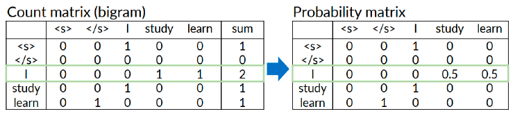

# Language Modeling


## Slide 1 – Language Modeling

📌 Topic: **Language Modeling (LM)**  
- Based on the concept of probability over word sequences.
- Includes: Markov Assumption, N-gram models, Perplexity, and Smoothing.

Presented by: Hamidreza Baradaran Kashani


---


## Slide 2 – Topics in This Section

- What is a Language Model (LM)?
- Markov Assumption
- N-gram probability estimation
- Evaluating LMs (Perplexity)
- Generalization and zero probabilities
- Laplace Smoothing

---


## Slide 3 – Intro to Language Modeling (LM)

Language Modeling means:
- Assigning a **probability** to a sequence of words in a language.

Example use:
- In Machine Translation (MT):
  - P("high winds tonite") > P("large winds tonite")
  → because it's more natural.


---


## Slide 4 – More Uses of Language Models

Language Models help in:

- **Spell Correction**:
  - P("about fifteen minutes from") > P("about fifteen minuets from")

- **Speech Recognition**:
  - P("I saw a van") >> P("eyes awe of an")

- Also useful in QA, summarization, etc.


---

## Slide 5 – What LM Really Does

Goal: Compute probability of a sentence like:

```text
P(W) = P(w1, w2, w3, ..., wn)
````

Using conditional probabilities:

```text
P(w5 | w1, w2, w3, w4)
```

→ This is the base idea of Language Models.


---


## Slide 6 – Example: Sentence Probability

Sentence:  
```text
Its water is so transparent that ...


We want to calculate:

```text
P(its, water, is, so, transparent, that)
```

How?
→ Use **Chain Rule of Probability**

````

---

## Slide 7 – Chain Rule Formula

To calculate:

```text
P(its water is so transparent)
````

We use:

```text
P(its) ×
P(water | its) ×
P(is | its, water) ×
P(so | its, water, is) ×
P(transparent | its, water, is, so)
```

This method is exact, but can be complex without simplification.


## Summary: Language Modeling (Slides 8–21)

- We want to compute the probability of a sentence:
  P(w1, w2, ..., wn)

- We use the **chain rule** to break it down:
  P(w1) × P(w2 | w1) × P(w3 | w1, w2) ...

- This gives accurate results but is **computationally expensive**.

- Why? Because there are too many word combinations to count.

- So we simplify using the **Markov assumption**:
  Only look at a few previous words (not all of them).

- **Unigram model**:
  Each word is independent:  
  P(w1, w2, ...) = P(w1) × P(w2) × ...

- Unigram output sounds random:
  “fifth an of futures the an ...”

- **Bigram model**:
  P(wi | wi-1), uses 1 previous word.

- Bigram output has more structure:
  “texaco rose one in this issue is ...”

- **Trigram model**:
  P(wi | wi-2, wi-1), uses 2 previous words.

- These are called **N-gram models** (N = 1, 2, 3, ...)

- Higher N means more context but also more data needed.

- We estimate probabilities using counts:
  P(w2 | w1) = Count(w1, w2) / Count(w1)

- Example:
  P("am" | "I") = Count("I am") / Count("I")

- N-gram models are trained by counting word sequences from real data.

- Used in many NLP tasks like translation, speech recognition, and autocomplete.

## Slide 22 – N-gram Probability (General Formula)

P(w1, w2, ..., wn) ≈  
P(w1) × P(w2 | w1) × P(w3 | w1, w2) × ... × P(wn | wn-2, wn-1)

⬇️ In trigram form (3-gram):

P(wi | wi−2, wi−1) = Count(wi−2, wi−1, wi) / Count(wi−2, wi−1)

## Summary – Slides 23 to 30: Start/End Tokens & N-gram Probability

1. Use `<s>` to mark the start of a sentence, and `</s>` for the end.

2. In bigram models:
   - P("first word" | `<s>`)
   - P(`</s>` | "last word")

3. In trigram models:
   - Add two start tokens: `<s> <s> I am Sam </s>`

4. These tokens help handle:
   - The beginning of a sentence (provides context)
   - The end of a sentence (tells the model when to stop)

5. Without `</s>`, the model may keep generating words forever.

6. N-gram sentence probability:
   - P(w1, w2, ..., wn) ≈  
     P(w1|<s>) × P(w2|w1) × ... × P(</s>|wn)

7. Probabilities are calculated using counts from real data:
   - P(wi | wi-1) = Count(wi-1, wi) / Count(wi-1)

8. Final sentence probability is the product of all N-gram probabilities.

## Slide 32 – Count Matrix

- Create a **matrix of counts** for all bigrams in the corpus.
- Rows = previous word, columns = next word.
- Each cell contains the number of times that bigram occurred in the training data.

## Slide 33 – Probability Matrix

- Convert the count matrix into a **probability matrix**.
- Formula:
  P(next_word | previous_word) = Count(previous_word, next_word) / Count(previous_word)
- Each row in the probability matrix sums to 1.

## Slide 34 – Language Model

- The probability matrix becomes the **language model**.
- This model can:
  - Calculate the probability of a sentence.
  - Generate new sentences based on learned probabilities.

## Slide 35 – Example Sentences

Example dialogue-related sentences for training:
- can you tell me about any good cantonese restaurants close by
- mid priced thai food is what i’m looking for
- tell me about chez panisse
- can you give me a listing of the kinds of food that are available
- i’m looking for a good place to eat breakfast
- when is caffe venezia open during the day



## Slide 43 – Evaluating a Language Model

- We want to know: How good is our LM?
- A good LM:
  - Gives higher probabilities to more common/realistic sentences.
  - Gives lower probabilities to rare/incorrect sentences.
- It should reflect both grammatical correctness and common usage.

## Slide 44 – Evaluation Process

- Train the LM on a **training set**.
- Test it on a **different test set** that the model hasn’t seen.
- Use an **evaluation metric** to measure how well the LM predicts the test set.

## Slide 45 – Why Separate Data?

- The training set is for learning parameters.
- The test set is for checking performance.
- The test set must be different to avoid overfitting.
- The evaluation metric tells us how good the LM is on unseen data.

## Slide 46 – Extrinsic Evaluation

- Measure LM performance inside a **real application**.
- Examples:
  - Spell correction → % of correctly fixed words.
  - Machine translation → % of correct translations.
  - Speech recognition → Word Error Rate (WER).
- Compare two LMs (A vs. B) in the same task.

## Slide 47 – Problems with Extrinsic Evaluation

- Time-consuming and expensive.
- Not always practical for every task.
- Suggested alternative: **Intrinsic Evaluation** (e.g., perplexity).
- Intrinsic evaluation is faster, but only works well if the test data is very similar to the training data.

## Slide 48 – Shannon Game

- A simple way to measure LM quality:
  - Hide the next word and ask the model (or a human) to guess it.
- Unigram models perform poorly at this game.
- N-gram models do better because they use context.


## Slide 49 – Perplexity (Important)

### Definition
Perplexity measures how well a language model predicts a sequence of words.

It answers:
> "On average, how many equally likely choices does the model think it has for the next word?"

---

### Calculation Steps
1. Take a test set (sentences not seen in training).
2. Compute the probability of the whole sequence: P(w1, w2, ..., wN).
3. Normalize by the sequence length (N).
4. Take the inverse of that average probability.

---

### Formula
Perplexity = ( 1 / P(w1, w2, ..., wN) )^(1/N)  

Where:
- **P(w1, ..., wN)** = probability of the sequence
- **N** = number of words

---

### Interpretation
- **Lower perplexity** → Better model (less uncertainty)
- **Higher perplexity** → Worse model (more uncertainty)

---

### Example
If Perplexity = 10:
- The model’s uncertainty is like having 10 equally likely next-word options.

## Slide 50 – Perplexity with Chain Rule

- For a bigram model:
  P(w1, w2, ..., wN) = ∏ P(wi | wi-1)

- Perplexity formula:
  PP(W) = ( ∏ (1 / P(wi | wi-1)) )^(1/N)

- This multiplies the inverse probabilities of each word in the test set, then normalizes by sentence length.

---

## Slide 51 – Start Token in Perplexity Calculation

- Sentences include the start token `<s>` for probability calculation:
  Example: "<s> I am Sam </s>"
- This lets us compute:
  P("I" | `<s>`), P("am" | "I"), etc.

---

## Slide 52 – Why `<s>` Is Excluded from N

- `<s>` is not a real word — it’s just a marker for sentence start.
- We **use it** in probability calculation, but we **don’t count it** in N (sentence length) for perplexity.
- Including it in N would distort the score because it’s too easy to predict.

## Slide 53 – Log Perplexity

**Why logs?**
- Multiplying many tiny probabilities underflows.
- Using logs turns products into sums:  
  log(P1·P2·…·PN) = Σ log Pi

**Formulas**
- Using natural logs:
  PP = exp( − (1/N) · Σ ln P(wi | context) )
- Using base-2 logs:
  PP = 2^( − (1/N) · Σ log2 P(wi | context) )

**Meaning**
- It’s the exponentiated **average negative log-probability per token**.
- Lower PP ⇒ model is less “confused”.

**Tiny example (base-2)**
- Probabilities: 0.2, 0.5, 0.25
- Average −log2: [−log2(0.2) − log2(0.5) − log2(0.25)] / 3 = 1.774
- PP = 2^1.774 ≈ **3.41**


## Slide 58 – Out of Vocabulary (OOV) Words

- OOV = words not seen in the training set.
- Problem: The model cannot directly assign a probability to them → probability = 0.
- This issue occurs in all N-gram models.

---

## Slide 59 – Why OOV is a Problem

- If even one OOV word is in a sentence, the probability of the entire sentence becomes zero.
- This means the model cannot score or process the sentence.
- In real tasks (translation, search, etc.), this can cause the model to fail.

---

## Slide 60 – Example of OOV Problem (Very IMPORTANT)

**Training set:**
- I like apples
- He eats oranges

**Test sentence:**
- I like bananas

"bananas" does not appear in training →  
P("bananas" | "like") = 0 → sentence probability = 0

**Solutions:**
- Use a special `<UNK>` token to replace all OOV words.
- Use smoothing methods to assign a small probability to OOVs.

## Slide 60 – OOV Example

**Training sentences:**
- I like apples
- He eats oranges

**Test sentence:**
- I like bananas

"bananas" was not seen in training →  
P("bananas" | "like") = 0  
→ Sentence probability = 0

---

## Slide 61 – Generalization Problem

- N-gram models can't handle new or rare sequences well.
- They memorize frequent patterns, but fail on unseen ones.
- This limits their generalization to real-world data.

---

## Slide 62 – Counting is Not Enough

- N-gram models rely only on counts.
- No understanding of meaning or grammar.
- They need smoothing or other methods to handle unknowns.

---

## Slide 63 – Shannon's Sentence Generator

- Start from `<s>` (start of sentence).
- Use probabilities from the bigram model to pick the next word.
- Move forward word by word until `</s>` (end).
- Each sentence generated is random but follows training statistics.

Example:
`<s> I want Chinese food </s>`

---

## Slide 64 – Sentences from Shannon's Game

Some randomly generated bigram-based outputs:
- "texaco rose one in this issue is ..."
- "coca cola was in the public eye ..."
- "i am not going to make it easy ..."

These may sound weird, but they're syntactically okay due to learned word sequences.

---

## Slide 65 – Problem with N-gram Models

- No understanding of **meaning**.
- "Colorless green ideas sleep furiously" gets a high probability if the word sequences exist.
- But meaningless sentences may still be considered "good" by the model.

---

## Slide 66 – Dealing with OOV Words

- Replace unknown words with a special token: `<UNK>`
- Train the model with `<UNK>` as a normal word.
- At test time, any unknown word becomes `<UNK>`, which the model can now handle.

---

## Slide 67 – Summary: Problems of N-gram Models

- Can't handle OOV words without tricks like `<UNK>`.
- Don't generalize well to unseen sentences.
- Just memorize counts — no real understanding.
- Don't scale well with large vocabulary or long context.


## Slide 69 – Generalization Problem

- N-gram models memorize seen word sequences.
- They fail to handle new or slightly different phrases.
- Example:
  - Seen in training: "a healthy meal"
  - Test: "a wholesome meal"
  → The model assigns zero probability even though the meaning is similar.

---

## Slide 70 – No Word Similarity

- Words are treated as IDs with no meaning.
- The model doesn’t know that:
  - "car" ≈ "automobile"
  - "city" ≈ "town"
- This prevents the model from understanding or generalizing based on meaning.

---

## Slide 71 – Explosion of Parameters

- The number of parameters grows fast as N increases.
- Bigram: vocab²
- Trigram: vocab³
- 4-gram: vocab⁴
- Example: For vocab = 10,000 → trigram = 10¹² entries
- Huge memory usage and training data needed.

---

## Slide 72 – Parameter Explosion Example

Vocabulary size = 20,000:
- Unigram: 20,000
- Bigram: 400 million
- Trigram: 8 trillion

Most combinations will never appear → model is sparse and inefficient.

---

## Slide 73 – N-gram Limitations Summary

1. Poor generalization to unseen data
2. No sense of word similarity or meaning
3. Data sparsity: many combinations are missing
4. Parameter explosion: huge memory requirements for higher N
